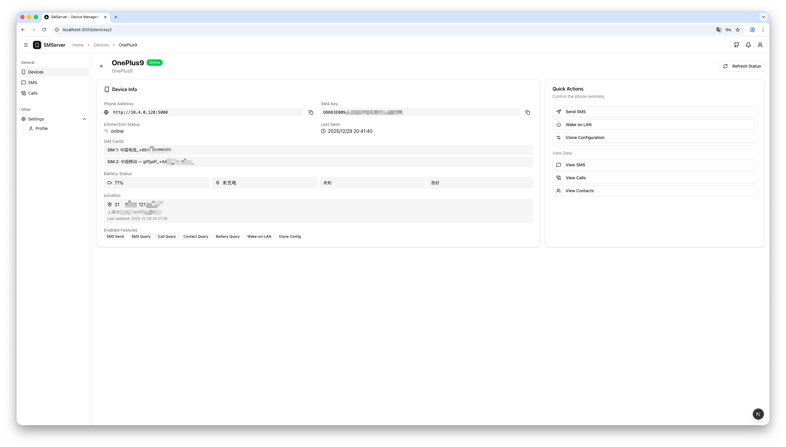
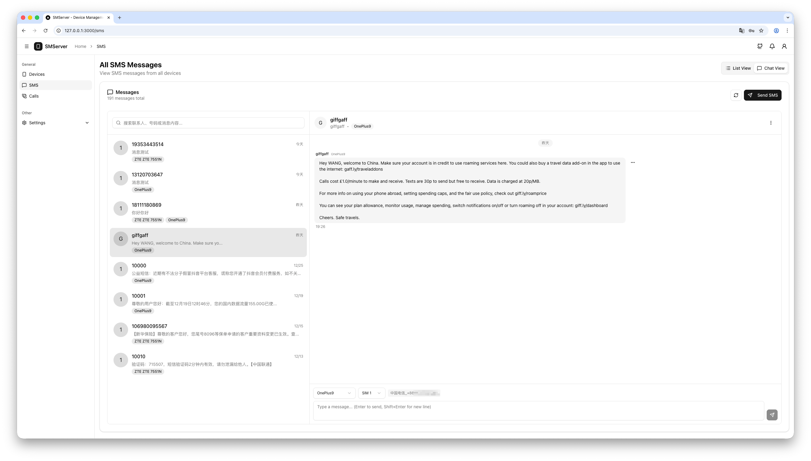
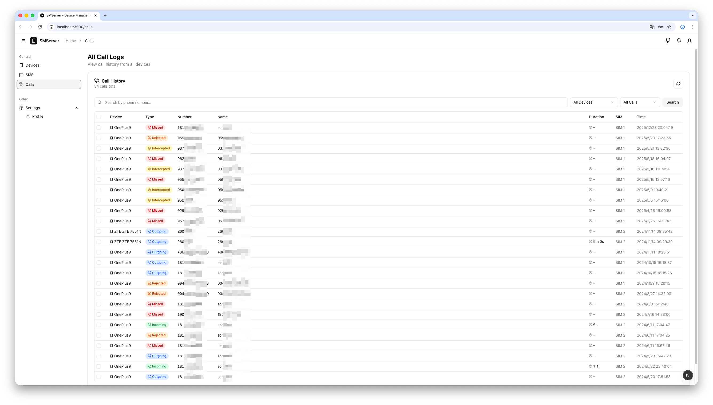

# SMServer

Self-hosted control panel for managing Android phones running the SmsForwarder app. The Go backend talks to the phone's SmsForwarder HTTP server (with SM4 encryption), syncs SMS/calls/contacts into MySQL, and exposes APIs that the Next.js dashboard consumes.

## Features
- Manage multiple phones/devices and their SM4 keys from one place.
- Sync and browse SMS, call logs, and contacts; send SMS remotely.
- Poll battery/online status, query location, and run Wake-on-LAN via the phone.
- Pull/push SmsForwarder configuration for quick device replacement.
- JWT-based admin authentication with default admin seeded on first run.
- REST API documented in `docs/smserver_api_docs.md`.

## Screenshots

### Device Management

*Manage multiple devices with real-time online status and battery monitoring*

### Device Details

*View device information, quick actions, and enabled features*

### SMS Messages

*Browse conversations and send SMS remotely*

### Call Logs

*View call history with detailed information*

## Repository layout
- `backend/` — Go 1.21+ service (Gin + XORM + MySQL).
- `smserver-web/` — Next.js 16 + React 19 dashboard (Tailwind CSS v4).
- `docs/` — API reference and encryption notes.

## Prerequisites
- Go 1.21+ (module target is 1.25).
- MySQL instance reachable from the backend.
- Node.js 18.18+ and `pnpm`/`npm`/`yarn` for the web UI.
- Android device with SmsForwarder installed and its HTTP server enabled with SM4 encryption.

## Backend setup (`backend/`)
1) Copy the sample config and edit it:
```bash
cd backend
cp config.sample.yaml config.yaml
```
- `app.addr`: listen address (default `:8080`).
- `app.jwt_secret`: required; used to sign JWTs.
- `app.allow_origins`: CORS whitelist for the web UI.
- `database.dsn`: MySQL DSN such as `user:pass@tcp(host:3306)/smserver?charset=utf8mb4&parseTime=True&loc=Local`.
- `security.default_admin_user` / `security.default_admin_password`: seeded admin on first launch.
- Only MySQL is supported; tables are auto-created on startup via XORM.
- Override the config path with `SM_SERVER_CONFIG=/path/to/config.yaml` if needed.

2) Create the database schema (blank DB is fine; tables are migrated automatically):
```sql
CREATE DATABASE smserver DEFAULT CHARACTER SET utf8mb4;
```

3) Run the API server:
```bash
go run ./...
# or build
go build -o smserver .
./smserver
```
The background battery/online poller runs every 5 minutes. Logs print SQL statements and sync progress.

4) Sign in to the API/UI with the default admin credentials from `config.yaml`, then change the password.

## Web dashboard (`smserver-web/`)
1) Install dependencies:
```bash
cd smserver-web
pnpm install    # or npm install / yarn
```
2) Point the UI to your backend (defaults to `http://localhost:8080`):
```bash
export NEXT_PUBLIC_API_URL="http://<backend-host>:8080"
```
3) Start the dev server:
```bash
pnpm dev
```
Open `http://localhost:3000` and log in with the admin account. Production build: `pnpm build && pnpm start`.

## Adding a device (quick path)
1) On the phone, open SmsForwarder → enable "主动控制·服务端", choose SM4 encryption, copy the 32-hex SM4 key, and make sure the phone is reachable (LAN IP or tunneled domain).
2) In the dashboard, create a device with the phone's base URL (e.g., `http://192.168.1.100:5000`) and the SM4 key.
3) Use "Test connection" to verify; then sync SMS/calls/contacts or send SMS from the UI. The backend caches data in MySQL and will poll battery/online status automatically.

## API documentation
- SMServer endpoints (JWT-protected): `docs/smserver_api_docs.md`.
- Original SmsForwarder server API reference: `docs/smsforwarder_server_api_docs.md`.
- SM4 implementation notes: `docs/SM4_FIX_REPORT.md`.

## Useful commands
- Lint backend (go vet): `go vet ./...`
- Run backend tests: `go test ./...`
- Lint web (ESLint): `pnpm lint`

## License
MIT © 2025 Shihao
